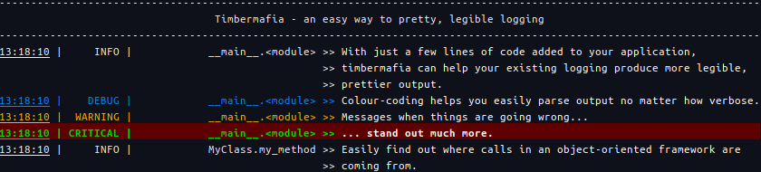
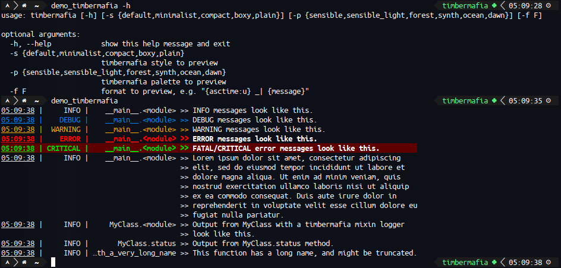
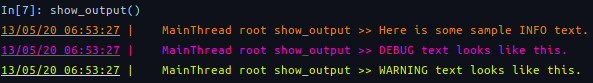
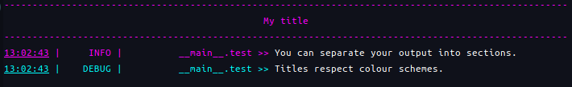
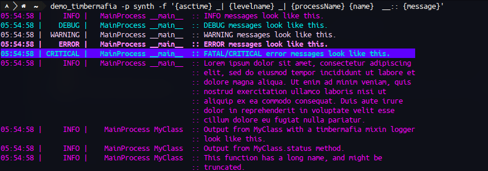
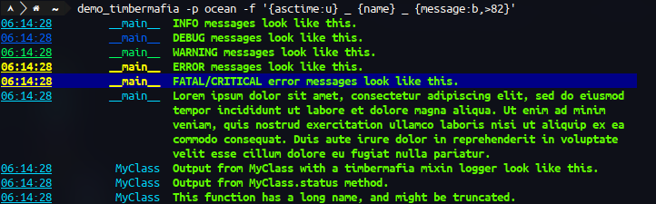

# timbermafia



`timbermafia` is a python package that makes implementing good-looking
and flexible logging easy.

Setting up your existing logging to stdout, with fixed-width columns and
printout over multiple lines, is as easy as replacing your application's
existing logging configuration with the following in your script or
top-level application module:

```python
import timbermafia as tm
tm.basic_config()
```

`timbermafia` is built on python's `logging` module, so plugs in to any
python application that uses `logging` seamlessly.

## Installation

`timbermafia` is available on the Python Package Index (PyPI).

```
pip install timbermafia
```

It requires python version 3.6 or later.

## Features

`timbermafia` implements a formatter with the following features:
- vertically aligned, column-based output, with adaptively allocated and
  tweakable widths.
- output over aligned, multiple lines, with truncation support for
  fields to fit into a single line.
- an expanded fmt_spec for the logging format, allowing for log record
  fields to be formatted individually with 8-bit ANSI colours and
  formats.
- colourised and formatted output for each different logging level.
- a variety of pre-configured styles and colour palettes.

## Try it out!

Once installed with `pip`, a script called `demo_timbermafia` is placed
in the user's bin. The user can specify a style, colour palette, and
logging format to be used:



The available styles and colour palettes can be shown with

```python
import timbermafia as tm
tm.print_styles()
tm.print_palettes()
```

Once you've found a style and palette you like, you can configure this
in your script or application with something like:

```python
import timbermafia as tm
import sys
tm.basic_config(style="compact", palette="dawn",
                stream=sys.stdout,      
                filename="/tmp/my_output.log",
                format="{asctime:u} _| {threadName} {name} {funcName} __>> {message}",
                datefmt="%d/%m/%y %H:%M:%S")
```

and you can get output like this from your existing logging calls:



For information on the full functionality of `timbermafia.basic_config`,
which is very analogous to `logging.basicConfig`, use python's help
function on it.

## Titles in logging

Timbermafia supports monkey patching of the `logging.Logger` class to
enable any Logger object to print a title with a divider to the output.

To enable this run

```python
import timbermafia as tm
tm.monkey_patch_logger()
```

and then from any logger do e.g.:

```python
import logging
log = logging.getLogger()
log.header('My title')
log.info('You can separate your output into sections.')
log.debug('Titles respect colour schemes.')
```

to produce the following in your logging output.




## Formats

`timbermafia` expands what is possible in a logging format, adding
support for a variety of features.

### Vertically-aligned columns.

The user can specify columns to be used in the output, which for long
messages, names, function names etc. can be used to print legible
multi-line output.

The column widths adapt based on what fields are present in them, so
columns containing a high amount of output get more room.

An example format using 4 columns, containing respectively the:
- date/time
- level name
- process name and log name
- log message

can be specified with a column escape, by default "_". Whatever follows
the column escape until the next whitespace is registered as output that
will visually separate the column.

So our format can be e.g.

```
{asctime} _| {levelname} _| {processName} {name}  __:: {message}
```

which produces the following output with the "synth" colour palette:



Note that we double-escape the final separator so that it prints over
all lines of multi-line output, and that multiple characters, or indeed
no characters, can be used as a column separator.

### Enhanced fmt_spec

Individual log records can be formatted according to a format
specification, or fmt_spec.

For example, the following output will force the message content to be
bold and bright green, overriding any formatting based upon the log
level, and underline the time to punctuate the start of a new log
record:

```
{asctime:u} _ {name} _ {message:b,>82}
```

Let's try that out with the "ocean" palette:



The following are recognised in the format spec via a comma-separated
list:
- b: bold
- e: emphasis/italic
- u: underline
- any int: the corresponding ANSI code, e.g. 5,9 will set slow blink and
  crossed-out text
- \>int: set the foreground colour to the 8-bit colour code.
- \<int: set the background colour to the 8-bit colour code.

Note that what ANSI codes will be possible is dependent on what terminal
or terminal emulator is being used.

A full list of the ANSI colour codes matched to some sample output can
be printed to the terminal with the included script
`display_ansi_colours`.

## Custom styles and palettes

Each style and palette can be generated into a Style or Palette object,
with a flexible customisation supported.

A full guide to customising styles and palettes can be found in [this
notebook](notebooks/styles_and_palettes.ipynb).

